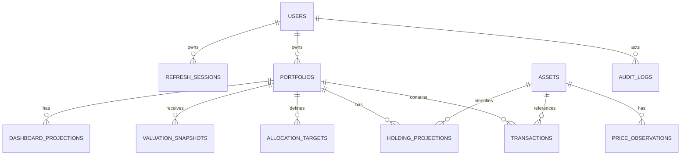
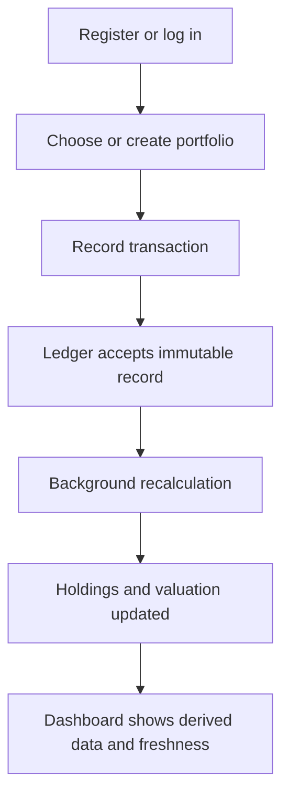
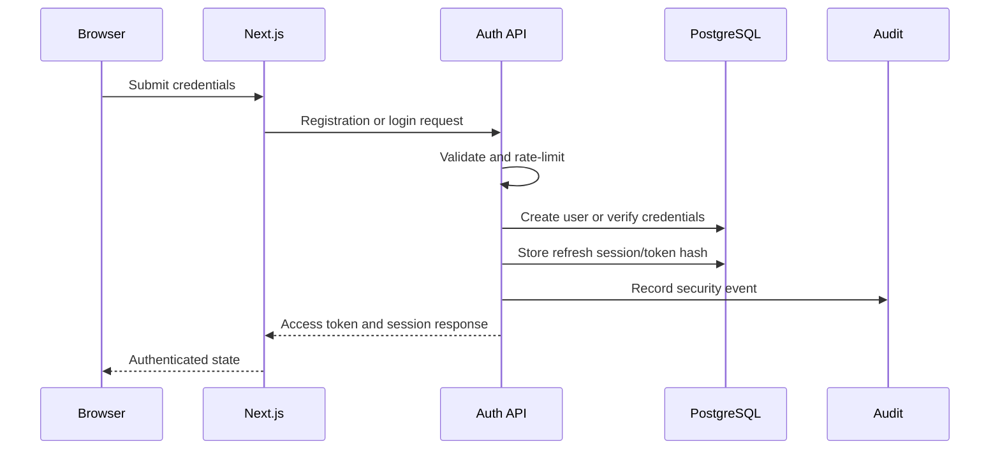

/Users/mac/.rvm/scripts/rvm:29: operation not permitted: ps
# AI Portfolio Research & Monitoring Assistant

## Planning Baseline

This document converts the approved product requirements into an implementation-ready plan. It is intentionally documentation only: it contains no application code, migrations, OpenAPI file, configuration, or infrastructure manifests.

The MVP is **Portfolio Foundation**: authentication, portfolios, assets, transaction ledger, price data, holding projection, valuation, allocation, and dashboard. Alerts, documents, AI research, and monthly review are post-foundation modules and are not MVP delivery commitments.

## 1. Architecture Review & ADR

### Review outcome

The proposed stack and modular-monolith direction are appropriate. The principal architectural risk is allowing convenience features (dashboard queries, frontend calculations, AI summaries, or provider data) to bypass the financial ledger. The following boundaries must be enforced from the first implementation:

- The transaction ledger is the financial system of record.
- Holdings, value, allocation, and dashboard data are derived projections and can be rebuilt.
- Money and quantities use decimal values end-to-end; a currency is always attached to money.
- Price observations are immutable sourced facts, not properties stored on an asset.
- Application use cases own write orchestration; handlers only authenticate, parse, validate transport DTOs, and serialize results.
- Financial calculation services are pure, versioned, deterministic functions.
- AI is read-only with respect to financial truth and must be supplied evidence by the backend.

### Module dependency policy

`identity` is depended on by user-owned modules. `portfolio` is depended on by transactions, targets, and projections. `asset` is depended on by transactions and prices. `transaction` and `price` publish facts consumed by `holdings`; `holdings` supplies valuations; valuation supplies allocation; allocation supplies dashboard. Dependencies only point toward a module's public application/domain interface, never into another module's infrastructure package.

### ADR-001 — Modular monolith

**Decision:** One Go deployment unit, one PostgreSQL database, a separately scalable worker process, and strict package/module boundaries.

**Rationale:** Ledger updates, ownership checks, audit logging, and outbox writes need atomic local transactions. Microservices would introduce distributed consistency and operational overhead before independently scalable workloads exist.

**Consequence:** Module interfaces and ownership must be treated as extraction seams. Direct cross-module table writes are prohibited.

### ADR-002 — Transaction ledger is authoritative

**Decision:** Transactions are immutable business records. Holdings cannot be manually edited.

**Rationale:** A ledger can reproduce positions and makes corrections traceable. Manual holding edits create an unreconcilable second truth.

**Consequence:** Corrections use a reversal/replacement or adjustment workflow, with an audit link to the original record.

### ADR-003 — Decimal financial model

**Decision:** Money and asset quantities use fixed-precision decimals, never binary floats.

**Rationale:** Decimal arithmetic and a centralized rounding policy are required for reconcilable calculations.

**Consequence:** API values are decimal strings; database numeric precision is centrally specified; frontend only formats server-provided values.

### ADR-004 — Transactional outbox and internal events

**Decision:** A committed write records its domain event in the same database transaction; workers deliver and process it at least once.

**Rationale:** This prevents a successful ledger write from losing its recalculation trigger.

**Consequence:** Consumers must be idempotent and maintain a processing checkpoint/deduplication record.

### ADR-005 — Dashboard as a read model

**Decision:** Dashboard requests read precomputed projection data rather than perform ledger calculation.

**Rationale:** This keeps request latency stable, eliminates duplicate formulas, and makes a broken view rebuildable.

### ADR-006 — AI cannot calculate financial facts

**Decision:** The AI module can explain backend-provided metrics and synthesize cited document evidence, but cannot calculate, alter, or authorize financial data.

**Rationale:** LLM output is probabilistic; portfolio numbers must be deterministic and reproducible.

### ADR-007 — OpenAPI-first external contract

**Decision:** A versioned OpenAPI document is the source of truth for HTTP contracts before implementation.

**Rationale:** It creates a reviewable agreement between frontend and backend, supports validation and generated clients, and prevents accidental breaking changes.

### ADR-008 — Transaction correction policy

**Decision:** Transactions remain immutable. A user corrects an erroneous transaction through a controlled reversal-and-replacement flow; an adjustment transaction is permitted only for explicitly approved business cases. Direct edits are not permitted after a transaction becomes effective.

**Rationale:** Reversal-and-replacement preserves the original business record, makes the correction visible to auditors, and gives holding calculations an unambiguous event sequence.

**Consequence:** The replacement transaction records its relationship to the corrected transaction, both actions are audited, and downstream projections are marked stale and rebuilt. The product must define which pre-effective draft states, if any, can be edited.

### ADR-009 — Cost-basis method

**Decision:** MVP uses FIFO cost basis per portfolio and asset. The cost-basis method is a versioned calculation policy, not a UI preference.

**Rationale:** FIFO is deterministic, familiar, and supports future lot-level reporting. Defining it centrally prevents holdings and realized-gain calculations from diverging.

**Consequence:** Holding projection retains sufficient lot/provenance information for reproducibility. A future weighted-average or jurisdiction-specific policy requires a new calculation version and a governed historical recomputation policy.

### ADR-010 — Decimal precision and rounding

**Decision:** Store money and quantities as fixed-precision decimals. Preserve input precision through intermediate calculations; round only at documented output boundaries using a centrally defined rounding mode per value type and currency.

**Rationale:** Early or inconsistent rounding produces irreconcilable valuations and allocation totals.

**Consequence:** API decimals are strings, frontend code never performs financial rounding, and calculation records identify the precision and rounding-policy version used. The exact scale by asset class/currency must be approved before implementation.

### ADR-011 — Price selection and freshness policy

**Decision:** Valuation selects a price observation through a versioned policy: eligible observations must have an accepted status, recognized source, matching asset/currency context, and an applicable data-as-of time. The latest eligible observation at or before the valuation cutoff is selected. Freshness is classified independently from selection.

**Rationale:** "Latest retrieved" is not necessarily the correct market price, and stale data must not be hidden.

**Consequence:** Every valuation records selected observation references, selection-policy version, data-as-of time, and freshness status. If no eligible price exists, the affected valuation is incomplete rather than fabricated. Market-specific freshness thresholds require product approval.

### ADR-012 — Multi-currency valuation policy

**Decision:** MVP supports one base currency per portfolio and records each transaction/price currency explicitly. Cross-currency valuation and FX conversion are deferred until a dedicated FX source, rate-selection, timing, and rounding policy is approved.

**Rationale:** FX conversion is itself financial market data; implicit conversion would undermine traceability.

**Consequence:** MVP either limits tradable assets to those valued in the portfolio base currency or displays non-base-currency positions as unvalued. Future multi-currency valuation must persist selected FX observations and conversion-policy version in calculation records.

## 2. Database Design — ERD and Tables

### Ownership and aggregate boundaries

Authoritative data is the business source of truth and is not rebuilt from projections. Derived data is entirely rebuildable from authoritative data and approved calculation/selection policies. Platform data supports security, delivery reliability, idempotency, and operations; it is neither financial source data nor a dashboard projection.

### Authoritative tables

| Table | Owner | Purpose and principal fields |
|---|---|---|
| `users` | Identity | ID, normalized email, password hash, display name, account status, created/updated timestamps. |
| `portfolios` | Portfolio | ID, owner user ID, name, base currency, status, archived timestamp, timestamps, aggregate version. |
| `assets` | Asset | ID, asset type, display name, primary identifier, exchange/market, trading currency, classification, active status. |
| `asset_identifiers` | Asset | Asset ID, identifier type/value, provider/exchange scope, active period. Supports multiple identifiers per asset. |
| `transactions` | Transaction | ID, portfolio ID, optional asset ID, type, effective timestamp, quantity, unit price, gross/net/fee money fields, transaction currency, note, external reference, correction parent ID, immutable creation metadata. |
| `price_observations` | Price | ID, asset ID, price decimal/currency, source, source record ID, retrieved-at, data-as-of, status, quality metadata. |
| `allocation_targets` | Allocation | ID, portfolio ID, target dimension/type, target key, target percentage, effective date, active status. |

### Derived / rebuildable tables

| Table | Owner | Purpose and principal fields |
|---|---|---|
| `holding_projections` | Holdings | Portfolio ID, asset ID, quantity, cost-basis values, calculation version, source transaction sequence/checkpoint, calculated-at, projection status. |
| `valuation_snapshots` | Holdings | ID, portfolio ID, valuation timestamp, total value in base currency, calculation version, selected-price policy version, status. |
| `current_allocations` | Allocation | Portfolio ID, allocation dimension/key, market value, current percentage, valuation snapshot ID, calculation version, calculated-at. |
| `dashboard_projections` | Dashboard | Portfolio ID, projection version, valuation snapshot ID, summarized totals, freshness/status, generated-at. |
| `calculation_records` | Holdings | Calculation ID, subject type/ID, formula identifier, calculation version, serialized input references/hashes, output reference, calculated-at. |

### Platform tables

| Table | Owner | Purpose and principal fields |
|---|---|---|
| `refresh_sessions` | Identity | Session ID, user ID, token-family ID, hashed refresh token, expiry, revoked/replaced timestamps, device metadata. |
| `transaction_idempotency` | Transaction | Portfolio ID, idempotency key, request fingerprint, transaction ID, response state, expiry. |
| `outbox_events` | Platform | Event ID, aggregate type/ID/version, type/version, payload, occurred-at, publication status and attempts. |
| `processed_events` | Platform | Consumer name, event ID, processed-at, result/checkpoint. |
| `job_executions` | Platform | Job ID/type/version, idempotency key, scope, schedule time, attempts, state, failure detail, timestamps. |
| `audit_logs` | Audit | ID, actor type/ID, action, target type/ID, correlation ID, timestamp, permitted before/after metadata. |

### Integrity and retention rules

- Financial rows are never hard-deleted. Portfolio archival suppresses use but retains history.
- Money fields are decimal plus currency; quantities are decimal. The financial precision/rounding policy is a governed domain specification.
- `transactions` receive an immutable portfolio-local sequence or equivalent calculation ordering marker.
- Transaction idempotency is unique within a portfolio and command scope.
- Price observations preserve source and timestamps; selection is a policy, not a database overwrite.
- Projection rows are replaceable only by their owning projection process. They retain source version/checkpoint and calculation version.
- Audit and outbox records are append-only, subject to an approved retention policy.

## 3. API Contract Design — OpenAPI-first

### Contract conventions

The future OpenAPI specification should be versioned with the API under `v1`, reviewed before implementation, and treated as the source for frontend type generation. It defines authentication, schemas, errors, pagination, idempotency, and all externally visible behavior.

All monetary and decimal quantity values are JSON strings, not numbers. Timestamps are ISO-8601 UTC instants. Resource IDs are opaque strings. Errors use a stable machine-readable `code`, human-readable `message`, `correlationId`, and optional field violations.

### Resource groups

| Group | Contract responsibility |
|---|---|
| Authentication | Register, authenticate, rotate/revoke sessions, return authenticated-user state. Refresh tokens are transport-secure and never exposed as application data. |
| Portfolios | Create, list, retrieve, update, archive, and select user-owned portfolios. |
| Assets | Search/read canonical asset metadata and supported classifications. |
| Transactions | Create immutable records, list ledger history, retrieve a record, initiate an approved correction flow. Every mutation requires an idempotency key. |
| Holdings | Retrieve derived positions with calculation/freshness/provenance metadata. |
| Prices | Retrieve selected price and source/status metadata for a permitted asset. |
| Allocations | Manage targets and retrieve current derived allocations. |
| Dashboard | Retrieve the portfolio dashboard read model and its generation/freshness state. |
| Operations | Restricted health/readiness and future administrative observability contracts; never expose internals to normal users. |

### Core schema families

- `Problem`: `code`, `message`, `correlationId`, `fieldErrors`.
- `Money`: `amount` as decimal string, `currency` as ISO code.
- `AssetQuantity`: decimal string and explicit asset/unit context.
- `CalculationMetadata`: formula ID, calculation version, calculated-at, input/reference IDs, status.
- `PriceMetadata`: source, source status, retrieved-at, data-as-of, freshness classification.
- `Page`: cursor-based page metadata; never offset pagination for unbounded transaction histories.
- `AuthenticatedUser`: ID, normalized public profile fields, session state.
- `PortfolioSummary`: identity, name, base currency, lifecycle status.
- `TransactionRecord`: immutable transaction payload, effective time, values, audit/correction relationship.
- `HoldingView`, `AllocationView`, and `DashboardView`: derived values plus calculation metadata, never mutable command payloads.

### Request processing standard

1. Verify access token and derive authenticated principal.
2. Validate media type, request size, schema, and decimal/currency formats.
3. Enforce resource ownership before returning existence information.
4. For mutations, verify idempotency key and request fingerprint.
5. Invoke one application use case within its database transaction.
6. Commit authoritative records and outbox event together.
7. Return a response DTO, correlation ID, and projection state when downstream calculation is asynchronous.

### Compatibility policy

Add optional response fields freely; do not repurpose a field's meaning. Breaking changes require a new API major version. Deprecations must have a published replacement and sunset period. API examples, generated types, and contract tests must derive from the approved specification.

## 4. Frontend Route and UI Flow

### Route map

| Route area | UI responsibility |
|---|---|
| `/login`, `/register` | Authentication forms, error states, session establishment. |
| `/app` | Authenticated landing/portfolio chooser. |
| `/app/portfolios` | Portfolio list, creation, archive access. |
| `/app/portfolios/[portfolioId]` | Portfolio overview redirect or shell. |
| `/app/portfolios/[portfolioId]/dashboard` | Read-only dashboard projection and freshness indicators. |
| `/app/portfolios/[portfolioId]/transactions` | Ledger history, filters, transaction entry, correction entry point. |
| `/app/portfolios/[portfolioId]/holdings` | Derived position view and calculation provenance. |
| `/app/portfolios/[portfolioId]/allocation` | Current derived allocation and target-allocation management. |
| `/app/assets` | Asset discovery/lookup as needed by transaction entry. |
| `/settings/security` | Sessions, logout, and future password/security controls. |

### Primary user flows

Transaction entry is a guided form: choose portfolio, choose transaction type, select asset where applicable, enter effective date and decimal values, review normalized values, submit once with an idempotency key, then show accepted/pending-projection status. The UI must never infer an updated holding locally.

### Frontend architecture rules

- Server components may compose authenticated pages; client components handle interactive forms and controlled filters.
- React Query owns remote query state and invalidation. It does not duplicate domain calculations.
- React Hook Form plus Zod validates user input for usability, while the backend remains authoritative.
- Feature folders own route-specific components, hooks, query keys, and view models.
- Shared components only handle presentation; they do not import feature-specific business logic.
- Loading, empty, stale, pending calculation, unauthorized, and error states are first-class UI states.
- Every calculated number displays relevant currency, data-as-of time, and stale/pending status where appropriate.

## 5. GitHub Milestones, Epics, and User Stories

### Milestone structure

| Milestone | Exit criterion |
|---|---|
| M0 — Architecture and Delivery Foundation | Architecture, policies, contracts, testing and operational standards approved. |
| M1 — Authentication | Users can securely register, log in, refresh, log out, and access only their resources. |
| M2 — Portfolio and Assets | Users manage archived/non-archived portfolios and select valid assets. |
| M3 — Transaction Ledger | Immutable, idempotent transaction recording with audit trail works. |
| M4 — Price Data and Holding Projection | Sourced price observations and deterministic holding projections work. |
| M5 — Valuation, Allocation, Dashboard | Derived valuation/allocation/dashboard are responsive, traceable, and reconciled. |
| M6 — Production Readiness | Monitoring, backup/recovery, security review, load and end-to-end checks are complete. |

### Epics and representative user stories

#### Epic: Identity and Access

- As a new user, I can register with a unique email and password so that I can own private portfolios.
- As a returning user, I can log in and retain a secure session without repeatedly entering credentials.
- As a user, I can log out and invalidate my active refresh session.
- As a user, I cannot retrieve, enumerate, or alter another user's resources.
- As an operator, I can investigate security-relevant authentication events through audit records without seeing secrets.

#### Epic: Portfolio Foundation

- As a user, I can create a portfolio with one explicit base currency.
- As a user, I can archive a portfolio without losing its historical transactions.
- As a user, I see only portfolios I own.

#### Epic: Transaction Ledger

- As a user, I can record a supported transaction once even if my client retries it.
- As a user, I can see immutable transaction history in effective-date order.
- As a user, I can correct an error through an approved, traceable process.

#### Epic: Deterministic Portfolio Views

- As a user, I can view derived holdings without manually maintaining them.
- As a user, I can understand when valuation uses stale or unavailable prices.
- As a user, I can compare current calculated allocation with my targets.

### Story quality standard

Each implementation story must include acceptance criteria, authorization rules, validation rules, audit/event expectations, failure behavior, observability needs, and test level. Stories should not bundle unrelated UI, domain, and infrastructure work merely to complete a screen.

## 6. Initial Project Bootstrap Plan

### Scope

Bootstrap establishes a maintainable workspace and engineering guardrails; it does not implement product behavior beyond the approved Phase 1 scope.

### Planned sequence

1. Confirm repository strategy: either create a dedicated repository/workspace for this product or explicitly replace the existing unrelated LINE/lead application. Do not combine the products accidentally.
2. Establish the monorepo layout for web, Go API, shared API contracts, tests, and documentation.
3. Define language/toolchain versions, formatting, linting, static analysis, dependency review, and secret-scanning policy.
4. Establish Go module boundaries and frontend feature boundaries that mirror bounded contexts.
5. Establish PostgreSQL development/test strategy, sqlc query ownership rules, goose migration governance, and migration review checklist.
6. Establish contract-first workflow: draft/review OpenAPI, generate or validate client types, and add contract tests before feature implementation.
7. Establish test pyramid: domain unit tests, repository/application integration tests, contract tests, and browser end-to-end tests.
8. Establish structured logging, correlation IDs, health/readiness checks, and local worker execution conventions.
9. Establish CI quality gates: formatting, lint, static checks, unit tests, integration tests, OpenAPI validation, dependency/security scanning, and build verification.
10. Document local development, test data policy, secrets handling, database reset policy, backup/recovery assumptions, and incident triage.

### Bootstrap acceptance criteria

- No module can import another module's internal infrastructure implementation.
- Developers can run deterministic unit and integration test suites locally.
- CI rejects contract-breaking changes, unformatted code, failed tests, and leaked secrets.
- All API responses can include a correlation ID.
- Database migrations have an owner, reversibility expectation, and review checklist.

The bootstrap-only execution order, gates, deliverables, and exclusions are maintained in [Initial Project Bootstrap Execution Plan](initial-bootstrap-execution-plan.md).

## 7. Phase 1 — Authentication Implementation Plan Only

### Objective

Deliver secure identity and session management on which resource ownership can rely. Phase 1 does not include portfolios, assets, transactions, financial calculations, AI, or document upload.

### In scope

- User registration using email and password.
- Login using email and password.
- Short-lived signed JWT access tokens.
- Refresh-token rotation with token-family/reuse detection strategy.
- Logout of current session and future support for logout-all-sessions.
- Authenticated-principal middleware/transport boundary.
- Ownership authorization primitive for later modules.
- Login/register/secure-session frontend states.
- Rate limiting and consistent error responses.
- Security and audit events.
- Unit, integration, contract, and end-to-end verification appropriate to authentication.

### Explicitly out of scope

- Social login, SSO, MFA, passkeys, password reset, email verification, organization roles, and admin UI.
- Portfolio authorization implementation beyond reusable ownership policies.
- Any financial domain functionality.

### Design decisions to finalize before implementation

- Access-token lifetime and refresh-session lifetime.
- Browser token transport: recommended approach is access token in memory and refresh token in secure, HttpOnly, SameSite cookie, subject to deployment-domain requirements.
- Refresh-token reuse response: revoke only the token family or all user sessions; recommended initial policy is revoke the affected family and record a high-severity security audit event.
- Password policy, password-hash algorithm parameters, and account lockout/rate-limit thresholds.
- Whether registration requires email verification before account activation. Recommended production policy: require verification before sensitive features, but this may be deferred if explicitly accepted as an MVP limitation.

### Authentication request lifecycle

### Backend responsibilities

- Domain: user account state, password policy abstractions, session lifecycle rules, refresh-token family rules, and security events.
- Application: registration, login, refresh, logout, authenticated-user query, and authorization use cases.
- Infrastructure: secure hashing, JWT signing/verification, cookie handling adapter, rate-limit adapter, and persistence repositories.
- Transport: DTO validation, safe generic authentication failure messages, security headers, cookie serialization, and correlation propagation.

### Frontend responsibilities

- Present accessible registration and login forms with client-side shape validation.
- Never persist refresh tokens in local storage or expose them through application state.
- Maintain user/session state from the authenticated-user contract.
- Send credentials only to approved API origins over TLS in deployed environments.
- Handle expired access token through one controlled refresh/retry path; prevent refresh loops.
- Clear client state and redirect safely when session refresh is rejected.

### Security acceptance criteria

- Passwords are never stored, logged, returned, or included in audit records.
- Refresh tokens are stored only as secure hashes at rest and are rotated on successful refresh.
- Reused/revoked refresh tokens are rejected and investigated through audit events.
- Authentication failure responses do not reveal whether an email exists.
- Rate limits apply to registration, login, and refresh attempts.
- All authenticated requests resolve an immutable principal and reject invalid/expired tokens.
- Authorization primitives deny by default and support ownership checks without requiring future modules to import identity persistence directly.
- Security audit records capture registration, successful/failed login, refresh, logout, and suspicious token reuse with correlation IDs.

### Test strategy and exit criteria

Domain unit tests cover password/session state rules and token-family transitions. Integration tests cover repository persistence, token rotation, revocation, rate limits, and atomic audit records. Contract tests verify request/response and error-schema compatibility. Browser end-to-end tests cover registration, login, protected navigation, refresh behavior, logout, and expired/revoked session behavior.

Phase 1 is complete only when the security acceptance criteria pass, test suites are automated, login/logout flows are observable, and no later portfolio module needs to redesign the identity contract.

## Deferred Work and Governance

ADR-008 through ADR-012 are closed for MVP by the Decision Closure Specification. Before document/AI work, approve storage retention, malware scanning, model/data handling, citation standards, and AI safety language.

All architectural changes should be recorded as ADRs. Any exception to the ledger/projection/decimal/AI boundaries requires an explicit architecture review.

The concrete MVP decisions that close these policy choices are maintained in [Decision Closure Specification](decision-closure-specification.md). That document is authoritative for Phase 1 authentication and for future Portfolio Foundation implementation.
