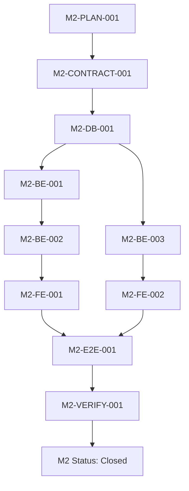

# Portfolio & Asset Foundation — Execution Plan

**Status:** Approved
**Version:** `M2-PORTFOLIO-ASSET-PLAN-v1`
**Milestone:** M2 — Portfolio & Asset Foundation
**Planning task:** `M2-PLAN-001`
**Planning branch:** `codex/m2-portfolio-asset-plan`
**Base:** protected `main` as represented by local `origin/main` at `7824492` (merged PR #33)
**Depends on:** M0 closed; M1 Authentication closed; approved ADRs and decision policies listed below
**Approval state:** Approved for implementation sequencing after merge

This document is an implementation plan only. It contains no Portfolio or
Asset implementation, OpenAPI changes, migrations, sqlc queries, runtime
configuration, frontend components, or business Playwright tests.

## 1. Objective and success criteria

M2 establishes the domain, persistence, API, and user-interface foundation for:

1. authenticated users owning Portfolios;
2. a system-managed, canonical Asset catalog shared by all users;
3. explicit ownership and authorization boundaries;
4. stable Portfolio and Asset identity;
5. neutral Portfolio management and Asset discovery flows; and
6. contract, database, backend, frontend, and real-stack verification seams for
   later financial milestones.

At M2 completion, an authenticated user should be able to create, list,
retrieve, update, and archive their own Portfolio, and search/read supported
canonical Assets. M2 must not answer any financial question. In particular,
M2 must not calculate or expose quantity, cost basis, average cost, price,
market value, P/L, allocation, performance, or returns.

M2 is successful only when the ordered implementation tasks pass their review
gates, all ownership and catalog constraints are evidenced, and M2 verification
proves that no Transaction Ledger, Holdings, Price, Valuation, Allocation,
Dashboard, or post-foundation behavior was introduced.

## 2. Sources and repository assessment

### 2.1 Authoritative sources

The implementation must use this precedence:

1. `docs/planning/decision-closure-specification.md` and the locked M2
   policies in this plan;
2. approved ADR decisions, including the ADR-001–ADR-012 content recorded in
   the Planning Baseline and ADR-013 in
   `docs/adr/ADR-013-solo-maintainer-merge-governance.md`;
3. `docs/planning/planning-baseline.md`;
4. the closed M1 completion evidence;
5. repository conventions and implementation details.

Sources inspected for this plan include:

- `docs/planning/planning-baseline.md`;
- `docs/planning/decision-closure-specification.md`;
- `docs/planning/authentication-phase-1-execution-plan.md`;
- `docs/engineering/authentication-m1-completion-report.md`;
- `docs/engineering/authentication-m1-acceptance-matrix.md`;
- `docs/architecture/module-boundaries.md` and
  `docs/architecture/repository-structure.md`;
- `docs/architecture/authentication-database.md`;
- `packages/api-contracts/openapi/v1.yaml` and generated contract conventions;
- `sqlc.yaml`, `backend/migrations`, `backend/queries`, and generated sqlc
  packages;
- the current frontend App Router and Authentication feature structure;
- `.github/workflows/ci.yml`;
- `docs/engineering/authentication-local-https.md` and the Authentication
  frontend/deployment runtime documentation.

### 2.2 Current repository foundation

The current protected-main state provides:

- a Go modular monolith with API and worker entry points;
- `backend/internal/platform` technical foundations and
  `backend/internal/identity` Authentication implementation;
- an identity `domain.Principal` and application operation boundary that later
  modules may consume through an explicitly public principal/authorization
  interface;
- Fiber HTTP routing through the generic
  `platform/httpserver.V1RouteRegistrar` boundary;
- PostgreSQL, Goose, sqlc, migration integration tests, and separate platform
  and identity generated packages;
- OpenAPI-first contracts in `packages/api-contracts/openapi/v1.yaml`, with
  generated TypeScript output and contract checks;
- Next.js App Router, React Query, React Hook Form, Zod, feature-local tests,
  and a neutral protected `/app` shell;
- real HTTPS Authentication infrastructure at
  `https://app.localhost:3443`, with Caddy routing to Next.js and the Go API;
- seven mandatory protected-main CI jobs: `frontend`, `backend`,
  `contracts-and-generation`, `database-integration`, `browser-e2e`,
  `compose-smoke`, and `secrets`.

### 2.3 Documentation/repository mismatches

The Planning Baseline predates M1 implementation and describes identity,
migrations, and routes as future work. Repository reality now includes those
M1 artifacts. The M2 plan therefore treats the current implementation as the
dependency and does not recreate or redesign Authentication.

The repository stores ADR-001–ADR-012 in the Planning Baseline rather than as
individual files under `docs/adr`; their recorded decisions remain applicable.
ADR-013 and Authentication security ADRs are separate files. This is a
traceability observation, not a blocker.

The documentation index still contains a historical note that AUTH-BE-003
runtime activation was pending review, while M1 completion evidence is closed
on protected `main`. M2 implementation must not rely on that stale note; a
separate documentation cleanup may correct it. It does not change M2 policy.

No contradiction was found in Portfolio ownership, active-name uniqueness,
archive semantics, canonical Asset identity, CRYPTO namespace, currency scope,
module boundaries, the Authentication principal contract, or protected CI
governance.

## 3. Scope

### 3.1 In scope

- Portfolio aggregate and ownership-aware lifecycle operations:
  create, list, get, update, and archive;
- case-insensitive normalized active-name uniqueness per owner;
- immutable Portfolio identity and USD base-currency selection;
- system-managed canonical Asset catalog read/search;
- exactly the supported Asset types `EQUITY`, `ETF`, and `CRYPTO`;
- deterministic symbol/exchange identity normalization;
- the canonical CRYPTO market namespace;
- OpenAPI contract review, generated types, database migrations/sqlc,
  backend use cases, frontend management/discovery, and real HTTPS E2E
  verification through the ordered tasks in this plan;
- ownership-safe errors, default-deny authorization, and absence of normal-user
  Asset mutation operations;
- deterministic, idempotent catalog bootstrap selected and documented during
  `M2-DB-001`.

### 3.2 Explicit non-goals

M2 must not implement or prepare production placeholders for:

**Transaction Ledger:** BUY, SELL, DIVIDEND, DEPOSIT, WITHDRAWAL, FEE,
ADJUSTMENT, transaction history, immutable correction, reversal/replacement,
FIFO, idempotent transaction commands, or transaction tables.

**Holdings:** quantities, lots, cost basis, average cost, cash positions,
holding projections, or a mutable `portfolio_assets`/`portfolio_holdings`
financial relation.

**Price and market data:** providers, observations, quote retrieval, market
close, freshness, fallback, market calendars, or venue pricing.

**Valuation and presentation:** market value, portfolio value, P/L, returns,
allocation, snapshots, or dashboard financial metrics.

**Post-foundation capabilities:** alerts, documents, RAG, research automation,
news, AI recommendations/analysis, and monthly reviews.

M2 also does not implement email verification, password reset, MFA, SSO,
social login, account administration, or any change to M1 Authentication
security, cookies, tokens, or trusted HTTPS behavior.

## 4. Inherited architecture and security constraints

- The product remains a modular monolith: one Go deployment unit, one
  PostgreSQL database, and a separately runnable worker.
- `portfolio` and `asset` are bounded contexts under
  `backend/internal/portfolio` and `backend/internal/asset` respectively.
- A module may depend only on another module's public domain/application
  interface. It may not import another module's infrastructure, transport, or
  generated sqlc package.
- Module-owned tables are written only by the owning module. Portfolio never
  writes Asset tables, and Asset never writes Portfolio tables.
- Handlers parse/validate/serialize and invoke application operations; domain
  rules do not live in Fiber handlers or React components.
- Authentication supplies the trusted principal. No client-supplied `user_id`
  or `owner_user_id` is authorization evidence.
- All authorization defaults to deny. Ownership is checked before returning
  resource existence information, with one stable ownership-safe public error
  behavior selected in `M2-CONTRACT-001`.
- `https://app.localhost:3443` remains the supported browser entrypoint. M2
  must not add HTTP Authentication fallback, CORS, token persistence, or
  cookie-policy changes.
- Decimal, FIFO, price, currency, outbox, and dashboard policies remain
  unchanged. M2 does not calculate financial values.

## 5. Locked Portfolio policies

### 5.1 `PORTFOLIO_LIFECYCLE-v1`

Portfolio lifecycle is:

```text
ACTIVE → ARCHIVED
```

Archive is an explicit domain operation (`ArchivePortfolio`), not arbitrary
status editing or a generic delete. The row remains persisted, identity stays
immutable, and historical references remain possible. Public application
behavior never hard-deletes a Portfolio. Archive requires normal ownership
authorization. Restore/unarchive is not part of M2; a future restore policy
must resolve active-name conflicts explicitly.

### 5.2 `PORTFOLIO_NAME-v1`

Names are unique per owner among `ACTIVE` portfolios after the approved
normalization:

1. trim leading and trailing whitespace;
2. compare case-insensitively;
3. preserve all other characters and whitespace semantics.

No punctuation removal, internal whitespace collapsing, transliteration, alias
mapping, or additional Unicode rules may be invented in M2. An archived name
does not reserve the active name, so the owner may reuse it after archive. A
different owner may use the same active name. The persistence design must
enforce the rule under concurrent creation, not rely only on a preflight read.

## 6. Asset bounded-context policies

### 6.1 `ASSET_TYPE-v1`

M2 supports exactly these canonical types:

- `EQUITY`
- `ETF`
- `CRYPTO`

The type describes the financial-instrument structure only. It is not a
strategy, sector, industry, portfolio classification, research category, or
risk category. A bond, commodity, or REIT ETF is `ETF`; a publicly traded REIT
security may be `EQUITY`.

The following are unsupported and must be rejected or excluded from the
supported catalog, never silently mapped to `OTHER`, `UNKNOWN`, or `CUSTOM`:
`BOND`, `MUTUAL_FUND`, `OPTION`, `FUTURE`, `FOREX`, `COMMODITY`, `INDEX`,
`CASH`, `REAL_ESTATE`, `CUSTOM`, and `OTHER`.

### 6.2 `ASSET_IDENTITY-v1`

Canonical Asset uniqueness is:

```text
normalized_symbol + normalized_exchange
```

Display name, type, and a provider-specific identifier alone do not establish
identity. Symbol and exchange normalization are deterministic domain/
persistence responsibilities and must be specified and tested in M2 before
catalog data is inserted. They must not be implemented in this planning task.

### 6.3 `CRYPTO_ASSET_IDENTITY-v1`

Crypto uses the canonical market namespace `CRYPTO`:

```text
BTC | CRYPTO
ETH | CRYPTO
SOL | CRYPTO
```

Coinbase, Binance, Kraken, and similar venues are future observation/provider
contexts, not canonical identity. The future price architecture must be able
to attach venue observations to one canonical Asset without fragmenting it.

### 6.4 `ASSET_CREATION-v1` and `ASSET_CATALOG-v1`

Assets are system-managed reference entities shared by all users. Normal
authenticated users may search and read supported Assets, but may not create,
edit, delete, or otherwise mutate canonical Assets. The public M2 API must not
include `POST /assets`, `PATCH /assets/{assetId}`, or
`DELETE /assets/{assetId}`.

Asset rows must not contain `owner_user_id`, `portfolio_id`, quantity, price,
average cost, cost basis, market value, or P/L. The catalog contains only
explicitly supported application instruments; an external provider's broader
universe is not application support.

### 6.5 Crypto and existing financial policies

Including `CRYPTO` in the read-only catalog does not authorize crypto
transactions, holdings, price selection, valuation, or allocation. M2 must
preserve `CURRENCY_SCOPE-v1` (USD-only portfolio base currency and current
financial processing restrictions) and `PRICE_SELECTION-v1` (approved US
equity/ETF official-close model). A future milestone must explicitly approve
policy changes before crypto participates in financial processing.

## 7. Domain and application architecture

### 7.1 Portfolio domain

The Portfolio domain owns:

- immutable opaque `PortfolioID`;
- owner identity reference;
- normalized/display name rules;
- immutable USD base currency;
- `ACTIVE`/`ARCHIVED` lifecycle and valid transition;
- creation, update, and archive timestamps;
- domain errors for invalid name, duplicate active name, archived mutation,
  and invalid transition.

It must not own transactions, holdings, prices, or financial calculations.

### 7.2 Asset domain

The Asset domain owns:

- immutable opaque `AssetID`;
- `AssetType` closed set;
- symbol and exchange/market normalization;
- canonical identity rules;
- display metadata and supported catalog lifecycle;
- read/search semantics and unsupported-type errors.

It must not own user ownership, Portfolio relations, transactions, prices, or
holdings.

### 7.3 Application operations

Portfolio application operations will be explicit and principal-scoped:

- `CreatePortfolio(principal, input)`;
- `ListPortfolios(principal, filter/page)`;
- `GetPortfolio(principal, portfolioID)`;
- `UpdatePortfolio(principal, portfolioID, input)`;
- `ArchivePortfolio(principal, portfolioID)`.

Asset application operations are read-only:

- `SearchAssets(principal, filter/page)`;
- `GetAsset(principal, assetID)`.

The application layer owns authorization orchestration and transaction
boundaries. It must not accept a client owner ID as proof. Asset reads may be
globally available to authenticated users, but normal users have no catalog
mutation operation.

### 7.4 Infrastructure and transport

Portfolio infrastructure owns only Portfolio persistence and queries. Asset
infrastructure owns only Asset persistence, catalog bootstrap, and search
queries. Transport owns DTO validation, pagination/cursor handling, route
registration, authentication-principal extraction, error mapping, and
serialization. Generated sqlc rows stay behind repository interfaces.

The API composition root should pass a public registrar to the generic
platform HTTP server; platform must not import Portfolio or Asset internals.

## 8. Contract direction — `M2-CONTRACT-001`

The following is direction for contract review, not an approved final API:

```text
POST  /api/v1/portfolios
GET   /api/v1/portfolios
GET   /api/v1/portfolios/{portfolioId}
PATCH /api/v1/portfolios/{portfolioId}
POST  /api/v1/portfolios/{portfolioId}/archive

GET   /api/v1/assets
GET   /api/v1/assets/{assetId}
```

`M2-CONTRACT-001` must freeze, with OpenAPI and contract tests:

- request/response DTOs and required fields;
- Portfolio `ACTIVE`/`ARCHIVED` status representation;
- immutable USD base currency behavior;
- exact name normalization and duplicate-name response;
- archive status code, response, and idempotency behavior;
- active/archived listing and filtering semantics;
- ownership-safe not-found/forbidden behavior without enumeration;
- Asset DTO fields and closed `AssetType` enum;
- search text normalization, type filter, pagination, and stable ordering;
- stable error codes and correlation IDs;
- generated TypeScript types;
- explicit absence of public Asset mutations;
- whether authenticated Asset reads use the standard Bearer scheme.

The contract must not expose quantities, prices, cost basis, P/L, allocations,
or any internal catalog/bootstrap fields. It must not expose client-supplied
ownership fields as authorization evidence.

## 9. Database direction — `M2-DB-001`

No migration is created by this planning task. `M2-DB-001` will design a new
forward migration owned by Portfolio/Asset, in dependency order, and update
sqlc generation only after the reviewed contract is merged.

### 9.1 `portfolios` conceptual requirements

- opaque immutable primary key;
- authenticated owner user ID with a foreign key to identity's user;
- display name and normalized comparison name;
- immutable `USD` base currency under `CURRENCY_SCOPE-v1`;
- lifecycle status limited to `ACTIVE` and `ARCHIVED`;
- `archived_at` consistent with status;
- created/updated timestamps and an aggregate/version field if needed by the
  concurrency design;
- ownership and active-name indexes justified by approved queries;
- no hard-delete query.

The concurrency-safe active-name rule should be enforced at PostgreSQL
persistence, preferably through a partial unique constraint/index over owner
and normalized name for `ACTIVE` rows. The exact implementation, status type,
and migration portability must be reviewed in `M2-DB-001`; application
preflight checks alone are insufficient. Archive must release the active-name
constraint so a new active Portfolio may reuse the name.

### 9.2 `assets` conceptual requirements

- opaque immutable primary key;
- symbol and normalized symbol;
- display name;
- closed AssetType value;
- exchange/market and normalized exchange/market;
- catalog currency metadata, with its meaning documented without authorizing
  financial processing;
- supported/active lifecycle representation if catalog retirement is required;
- canonical normalized symbol/exchange uniqueness;
- search indexes only for approved query shapes;
- no owner, Portfolio, holding, quantity, price, or valuation columns.

### 9.3 Catalog bootstrap selection

`M2-DB-001` and the Asset implementation review must select one deterministic,
idempotent, system-controlled bootstrap mechanism (migration data, a reviewed
fixture, startup process, worker import, or another architecture-compatible
mechanism). The selection must be reproducible in CI/test databases, safe to
deploy, independent of users, and independent of future price providers. Only
explicitly supported Assets may be loaded. The decision and its rollback/
upgrade behavior must be documented before catalog records are added.

### 9.4 Required persistence verification

`M2-DB-001` must verify:

- empty-database migration;
- upgrade from current protected `main`;
- permitted down/up behavior in disposable databases;
- deterministic sqlc generation and zero generated-code drift;
- concurrent duplicate active Portfolio creation;
- archive then active-name reuse;
- same name for different owners;
- canonical Asset uniqueness and unsupported type rejection;
- catalog bootstrap idempotency;
- ownership and canonical-identity indexes through actual query plans/tests.

## 10. Frontend direction

No route or component is created by `M2-PLAN-001`. Later frontend tasks may
introduce:

```text
/app
/app/portfolios
/app/portfolios/[portfolioId]
/app/assets
```

Portfolio UI must provide loading, empty, error, unauthorized/not-found,
create, update, duplicate-name, archive confirmation, active/archived state,
and a neutral detail shell. It must never render fake holdings, quantities,
value, P/L, allocation, or return metrics.

Asset UI must provide search, type filtering, canonical display metadata,
loading, empty, and error states. It must not provide Add Asset, Edit Asset, or
Delete Asset controls for normal users. React Query owns server state;
React Hook Form and Zod provide usability validation only. The backend remains
authoritative for ownership, lifecycle, normalization, and catalog support.

## 11. Test strategy

M2-PLAN-001 adds no tests. Future tasks assign tests as follows.

### Domain unit tests

- Portfolio: trim/case-insensitive name normalization, lifecycle transitions,
  invalid transitions, USD base currency, and domain validation;
- Asset: closed AssetType set, symbol/exchange normalization, canonical crypto
  namespace, and unsupported type rejection.

### Application tests

- Portfolio create/list/get/update/archive, duplicate active name, archived
  name reuse, ownership isolation, safe absence behavior, and archived
  mutation rejection;
- Asset search/get/type filtering, canonical identity, catalog support, and
  absence of public mutation operations.

### PostgreSQL integration tests

- Portfolio ownership persistence and foreign-key behavior;
- active-name uniqueness under two database connections;
- archive then reuse and same name across owners;
- Asset canonical uniqueness and catalog bootstrap idempotency;
- migration empty/upgrade/down/up verification;
- sqlc compilation and generated drift.

### API/contract tests

- DTO validation and standard error envelope;
- authentication and ownership checks;
- non-enumerating cross-user errors;
- duplicate-name conflict and archive operation;
- AssetType enum, search/filter, pagination, canonical metadata;
- no public Asset create/update/delete operations.

### Frontend tests

- Portfolio forms and validation;
- loading, empty, error, unauthorized, and archive states;
- Asset search/filter and metadata presentation;
- no Asset mutation controls;
- no financial calculations or fabricated financial values.

### Real browser E2E

`M2-E2E-001` must use:

```text
Chromium → https://app.localhost:3443 → Caddy → Next.js → Go API → PostgreSQL
```

It must not use `page.route()` or fake Portfolio/Asset responses. Critical
scenarios include:

- authenticated creation and own-list visibility;
- duplicate active-name rejection;
- update and archive;
- archived-name reuse;
- another user cannot read/update/archive the first user's Portfolio;
- EQUITY, ETF, and CRYPTO search/read;
- canonical Asset metadata rendering;
- no public Asset creation UI.

Tests must create isolated users through supported Authentication behavior or
an approved setup state. They must not inspect the HttpOnly cookie or persist
access tokens.

## 12. Security and ownership requirements

- Every Portfolio endpoint requires the M1 authenticated principal.
- Ownership derives from the principal's immutable user ID, never a body,
  query, or path owner ID.
- List queries are owner-scoped at the repository boundary.
- Get/update/archive queries include owner scope and use the approved stable
  ownership-safe error behavior; they must not reveal whether another user's
  resource exists.
- Archive is explicit, owner-authorized, and not hard delete.
- Asset read/search is global to authenticated users; Asset mutation remains
  unavailable to normal users.
- No M2 code may change JWT, refresh-cookie, HTTPS attestation, CORS, CSRF,
  rate-limit, HMAC, or Authentication policy.
- Logs and errors must not contain credentials, tokens, cookies, or raw
  sensitive request bodies. Asset/Portfolio search terms and identifiers must
  follow existing logging redaction conventions.
- Database and API responses must not serialize generated sqlc rows directly.

## 13. Operational and CI verification

M2 inherits current protected-main quality gates; it must not invent a second
pipeline. Before M2 closure, the applicable equivalents of the following must
pass:

- `pnpm format:check`, `pnpm lint`, `pnpm typecheck`, `pnpm test`, and
  `pnpm build`;
- `test -z "$(gofmt -l backend)"`, `go vet ./...`, `go test ./...`, API and
  worker builds, and `sh scripts/check-module-boundaries.sh`;
- OpenAPI lint/contract tests/generated TypeScript and generated-code drift;
- `sqlc generate` and sqlc drift checks;
- Goose empty/upgrade/down/up migration verification and PostgreSQL integration
  tests;
- real HTTPS browser E2E and Compose smoke;
- `govulncheck`, `pnpm audit --audit-level high`, secret scanning, and all
  seven mandatory remote jobs.

The plan must inspect CI job names at implementation time rather than assume
they remain unchanged. The current repository has the seven jobs listed in
§2.2. Every PR follows ADR-013: one purpose, self-review checklist, resolved
conversations, up-to-date branch, and all required checks before merge.

## 14. Ordered task sequence

Implementation begins only after this plan is approved and merged.

### M2-CONTRACT-001 — Portfolio and Asset API contracts

**Depends on:** approved/merged `M2-PLAN-001`.
**Scope:** OpenAPI v1 paths/schemas, generated TypeScript, contract tests only.

Freeze DTOs, lifecycle/status, base currency, normalization, duplicate-name
behavior, archive semantics, listing filters, AssetType, search/pagination,
stable errors, ownership-safe behavior, and absence of Asset mutations.

**Acceptance:** OpenAPI lint/tests pass; generated types are current; all
contract checks pass; no database/backend/frontend implementation changed;
`M2-CONTRACT-001 Review: Approved`.

**Complexity:** Medium. **Risks:** accidental financial fields or premature
ownership semantics. **Blocking gate:** required before database work.

### M2-DB-001 — Portfolio/Asset persistence and catalog bootstrap

**Depends on:** approved/merged `M2-CONTRACT-001`.
**Scope:** Goose migrations, sqlc queries/generated code, repository integration
support, constraints, indexes, and catalog bootstrap tests.

Select/document the deterministic catalog bootstrap mechanism; create only
`portfolios` and `assets` (plus explicitly required catalog-support objects);
enforce owner/name and canonical identity constraints; do not create holding,
transaction, price, or financial calculation tables.

**Acceptance:** migration empty/upgrade/down/up tests pass; concurrency and
bootstrap idempotency tests pass; sqlc is reproducible; module ownership is
documented; `M2-DB-001 Review: Approved`.

**Complexity:** Large. **Risks:** race-prone uniqueness, catalog drift,
cross-module foreign-key ownership. **Blocking gate:** required before backend
behavior.

### M2-BE-001 — Portfolio domain/application/repository behavior

**Depends on:** approved/merged `M2-DB-001`.
**Scope:** Portfolio domain, application operations, repository implementation,
principal-scoped authorization, lifecycle and name rules, and unit/application/
integration tests. No Portfolio HTTP transport and no Asset behavior.

**Acceptance:** all Portfolio domain/application/ownership/concurrency tests
pass; no Fiber or sqlc imports leak into domain/application; no Asset or M2
financial behavior is added; `M2-BE-001 Review: Approved`.

**Complexity:** Large. **Risks:** ownership checks in the wrong layer and
archive accidentally behaving as delete.

### M2-BE-002 — Portfolio HTTP transport

**Depends on:** approved/merged `M2-BE-001` and `M2-CONTRACT-001`.
**Scope:** Portfolio routes, principal integration, DTO/error mapping, archive
operation, ownership-safe responses, and API/security tests.

**Acceptance:** implementation matches the frozen contract; all routes require
the authenticated principal; cross-user behavior is safe; health/auth routes
remain unchanged; `M2-BE-002 Review: Approved`.

**Complexity:** Large. **Risks:** handler business logic, enumeration, route
registration coupling.

### M2-BE-003 — Canonical Asset read/search

**Depends on:** approved/merged `M2-DB-001` and `M2-CONTRACT-001`.
**Scope:** Asset domain, repository, search/get application operations, read
HTTP endpoints, AssetType support, canonical identity behavior, and tests.

**Acceptance:** only EQUITY/ETF/CRYPTO supported; canonical crypto namespace is
preserved; all reads are authenticated; no public create/update/delete,
provider, price, transaction, or holding behavior exists; `M2-BE-003 Review:
Approved`.

**Complexity:** Large. **Risks:** provider IDs becoming canonical identity and
catalog mutation leakage.

### M2-FE-001 — Portfolio user flows

**Depends on:** approved/merged Portfolio backend contract/runtime.
**Scope:** list, empty/loading/error states, create, update, detail shell,
archive, duplicate-name handling, and route transitions.

**Acceptance:** own-user flows work through the generated API client; no fake
financial metrics are rendered; no token persistence or Auth-policy changes;
`M2-FE-001 Review: Approved`.

**Complexity:** Large. **Risks:** frontend ownership assumptions and accidental
dashboard scope.

### M2-FE-002 — Asset discovery UI

**Depends on:** approved/merged Asset backend.
**Scope:** list/search, AssetType filtering, canonical metadata, loading,
empty, and error states.

**Acceptance:** EQUITY/ETF/CRYPTO reads render correctly; no Add/Edit/Delete
Asset UI exists; no prices, holdings, or valuation appear; `M2-FE-002 Review:
Approved`.

**Complexity:** Medium. **Risks:** implying catalog mutability or crypto
financial support.

### M2-E2E-001 — Real-stack M2 browser verification

**Depends on:** all M2 backend and frontend functional tasks.
**Scope:** real HTTPS Caddy/Next.js/API/PostgreSQL flows, isolated data,
ownership and lifecycle behavior, Asset discovery, security-boundary checks.

**Acceptance:** no Auth API mocking; all critical scenarios pass; no forbidden
financial UI or public Asset mutation is present; `M2-E2E-001 Review: Approved`.

**Complexity:** Large. **Risks:** fixture leakage, rate limits, environment
ordering, or confusing catalog read support with trading support.

### M2-VERIFY-001 — Full M2 verification and closure evidence

**Depends on:** all prior task gates.
**Scope:** complete acceptance matrix, completion report, CI/security/contract/
database/frontend/backend/E2E evidence, and scope review.

**Acceptance:** every M2 criterion passes, no critical check is blocked, no
forbidden scope was implemented, and only this task may propose `M2 Status:
Closed`.

**Complexity:** Medium. **Risks:** stale evidence, skipped remote jobs, or
undocumented deviations.

## 15. Pull-request and dependency governance

The sequence is intentionally contract → database → backend → frontend → E2E
→ verification. A later task must not be started or merged early merely
because its branch could be developed in parallel. Every PR is focused, uses
ADR-013's solo-maintainer self-review checklist, passes all required checks,
and is reviewed before merge. No insecure temporary behavior may be left on
`main`.

Suggested dependency graph:



## 16. Scope guard and stop conditions

Stop the affected task and record a blocker rather than inventing a rule if
repository evidence conflicts with an approved decision about:

- Portfolio ownership or principal extraction;
- active-name uniqueness, normalization, archive, or restore semantics;
- canonical Asset identity or CRYPTO namespace;
- Asset catalog ownership/bootstrap;
- USD currency scope or the current price policy;
- module boundaries or generated-package ownership;
- protected CI governance or required checks.

A blocker report must state the conflicting sources, exact repository evidence,
why implementation is ambiguous, and the focused decision required. It must
not silently modify an approved policy. Open implementation choices such as
the catalog bootstrap mechanism are scheduled decisions for their named task,
not permission to begin implementation in this planning task.

## 17. M2 Definition of Done

M2 is complete only when all of the following are evidenced:

- the approved M2 contract is implemented and generated outputs are current;
- Portfolio identity, owner isolation, normalized active-name uniqueness,
  archive transition, archived-name reuse, and USD immutable base currency
  work;
- Asset catalog supports only EQUITY, ETF, and CRYPTO with canonical
  symbol/exchange identity and CRYPTO namespace semantics;
- Assets are system-managed, globally readable to authenticated users, and
  have no public mutation flow;
- no Portfolio-Asset holding relation or financial calculation is introduced;
- migrations, sqlc, integration tests, and catalog bootstrap are deterministic;
- backend and frontend boundaries follow the modular-monolith rules;
- real HTTPS E2E covers ownership, lifecycle, catalog read/search, and absence
  of forbidden UI;
- formatting, lint, typecheck, tests, builds, vulnerability/secret scans,
  Compose smoke, and all protected CI jobs pass;
- documentation, acceptance matrix, completion report, and deviations reflect
  repository reality;
- M1 Authentication behavior and policies remain unchanged.

## 18. M2 closure criteria

Only `M2-VERIFY-001` may propose `M2 Status: Closed`, and only when every
critical criterion is `PASS`, verification evidence is available on the
reviewed protected-main state, required CI checks are enforceable, and no
Portfolio/Asset or later-milestone scope has been accidentally omitted or
expanded. If a critical criterion is failed or blocked, M2 remains open and
the exact blocker is recorded.

## 19. Self-review coverage matrix

| Requirement                                       | Plan section    | Status  | Notes                                                                          |
| ------------------------------------------------- | --------------- | ------- | ------------------------------------------------------------------------------ |
| Status, version, M0/M1 dependency, approval state | Metadata        | COVERED | Approved for implementation sequencing after merge; no implementation allowed. |
| M2 objective and success criteria                 | 1               | COVERED | Portfolio ownership and Asset catalog foundation.                              |
| Required sources and precedence                   | 2.1             | COVERED | Repository sources and policy order listed.                                    |
| Current repository assessment                     | 2.2–2.3         | COVERED | Actual Go, web, contracts, DB, CI, HTTPS state recorded.                       |
| Repository/documentation mismatch handling        | 2.3             | COVERED | Baseline/ADR/index mismatches explicitly recorded.                             |
| Portfolio lifecycle                               | 5.1             | COVERED | Explicit archive, no hard delete/restore.                                      |
| Portfolio name semantics                          | 5.2             | COVERED | Per-owner active uniqueness, trim/case-insensitive, no extra normalization.    |
| Asset type closed set                             | 6.1             | COVERED | EQUITY, ETF, CRYPTO only; unsupported values rejected/excluded.                |
| Canonical Asset identity                          | 6.2–6.3         | COVERED | Symbol/exchange and CRYPTO namespace.                                          |
| Asset creation authority/catalog                  | 6.4             | COVERED | System-managed, read/search only for users.                                    |
| Crypto compatibility with financial policies      | 6.5             | COVERED | No crypto transactions, prices, holdings, or valuation.                        |
| Ownership and module boundaries                   | 4, 7, 12        | COVERED | Principal-scoped Portfolio; shared Asset catalog; no private imports.          |
| OpenAPI-first contract direction                  | 8               | COVERED | M2-CONTRACT-001 freezes details; no contract changed here.                     |
| Database direction and constraints                | 9               | COVERED | Tables/indexes/concurrency/bootstrap requirements without SQL.                 |
| Catalog bootstrap selection                       | 9.3             | COVERED | Deferred to M2-DB-001 as a named, deterministic decision.                      |
| Frontend routes/UI direction                      | 10              | COVERED | Portfolio flows and Asset discovery; no financial UI.                          |
| Domain/application/infrastructure/transport split | 7               | COVERED | Responsibilities and dependency directions specified.                          |
| Domain/application/API/DB/frontend/E2E tests      | 11              | COVERED | Layer-specific assignments listed.                                             |
| Security requirements                             | 4, 12           | COVERED | Default deny, owner isolation, no Auth redesign or leakage.                    |
| CI/operational verification                       | 13              | COVERED | Current seven jobs and repository command categories inherited.                |
| Ordered task sequence                             | 14              | COVERED | All required M2 task IDs and review gates included.                            |
| Dependency graph                                  | 15              | COVERED | Mermaid graph preserves review-before-merge order.                             |
| Per-task acceptance criteria/complexity/risks     | 14              | COVERED | Every task has dependencies, scope, acceptance, complexity, risks.             |
| Scope guard/stop conditions                       | 16              | COVERED | Conflicts stop affected work; no hidden decisions.                             |
| M2 Definition of Done and closure                 | 17–18           | COVERED | Closure only through M2-VERIFY-001.                                            |
| No implementation changes in planning task        | Repository diff | COVERED | Only this plan and docs index are permitted.                                   |

**Coverage result:** 28 required planning areas reviewed; 28 `COVERED`, 0
`PARTIAL`, 0 `MISSING`, 0 `BLOCKED`.

## 20. Planning-task completion report

- **Branch/base used:** `codex/m2-portfolio-asset-plan`, based on local
  `origin/main`/`main` at `7824492` (merged PR #33). A fresh `git fetch origin`
  was attempted but could not resolve `github.com`; the existing tracking ref
  was used and matched the protected-main merge state available locally.
- **Sources reviewed:** Planning Baseline, Decision Closure Specification,
  AUTH-PLAN-v1, M1 completion/acceptance evidence, ADR-013 and recorded
  ADR-001–ADR-012 decisions, module/database/repository conventions, OpenAPI,
  sqlc/migrations, frontend runtime, HTTPS deployment docs, and current CI.
- **Planning files:**
  `docs/planning/portfolio-asset-foundation-execution-plan.md` created;
  `docs/README.md` updated with the proposed-plan link.
- **Decisions recorded:** Portfolio lifecycle/name, Asset type/identity/crypto
  namespace, system catalog authority, USD/financial-policy boundary,
  ownership, contract direction, persistence/concurrency direction, catalog
  bootstrap requirements, UI/test/security/CI boundaries, and ordered gates.
- **M2 scope:** authenticated Portfolio management and read-only canonical Asset
  discovery foundation.
- **Explicit non-goals:** Transaction Ledger, Holdings, Price, Valuation,
  Allocation, Dashboard, Alerts, Documents, AI, and all speculative financial
  behavior.
- **Ordered task sequence:** M2-CONTRACT-001 → M2-DB-001 → M2-BE-001 →
  M2-BE-002/M2-BE-003 → M2-FE-001/M2-FE-002 → M2-E2E-001 → M2-VERIFY-001.
- **Dependency graph:** Confirmed in §15; downstream work cannot bypass review
  gates.
- **Open decisions:** 0 architectural blockers. The catalog bootstrap
  mechanism is an explicitly scheduled M2-DB-001 selection, not an unresolved
  contradiction.
- **Blockers:** 0 policy/architecture blockers. Remote refresh was unavailable
  because of DNS, but the existing `origin/main` tracking state was available.
- **Requirement coverage:** 28/28 `COVERED`; 0 partial, missing, or blocked.
- **Implementation files changed:** 0. No backend, frontend, OpenAPI,
  migration, sqlc, Compose, runtime configuration, or business test files were
  changed.
- **Recommended review status:** `M2 Planning Review: Ready for Review`.

## 21. Recommended next step

Review and approve this plan. After it is approved and merged, begin only
`M2-CONTRACT-001 — Portfolio and Asset API contracts`. Do not begin database,
backend, frontend, E2E, Transaction Ledger, or financial implementation from
this planning task.
